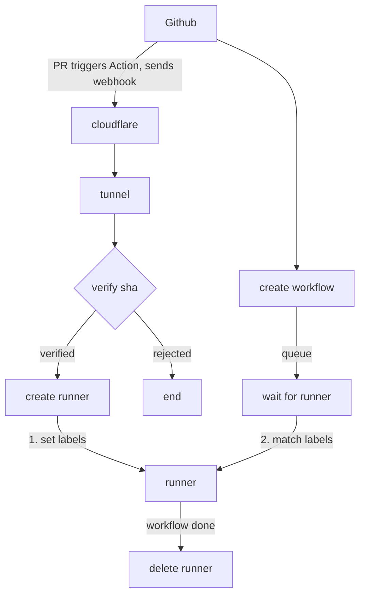
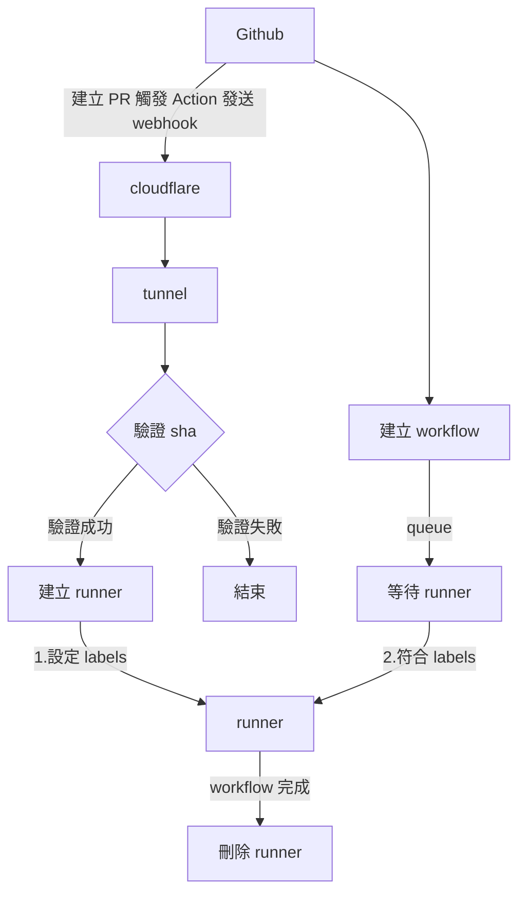

# GitHub Action Runner

A containerized solution that dynamically creates GitHub Actions self-hosted runners.
A GitHub webhook triggers the creation of an ephemeral runner container, which is
automatically destroyed once the job completes.

> 🌏 English | [繁體中文](#github-action-runner-中文)

## Table of Contents

- [Features](#features)
- [Architecture](#architecture)
- [Project Structure](#project-structure)
- [Requirements](#requirements)
- [Deployment](#deployment)
- [Docker Compose Services](#docker-compose-services)
- [Maintenance & Updates](#maintenance--updates)
- [Security](#security)
- [Dependencies](#dependencies)
- [Reference](#reference)
- [License](#license)

## Features

- **Dynamic runner creation**: spins up a Docker container as a runner upon receiving a GitHub webhook.
- **Ephemeral mode**: the runner is removed after the job finishes, keeping the environment clean.
- **GitHub App integration**: authenticates via a GitHub App instead of a Personal Access Token.
- **Webhook signature verification**: supports HMAC SHA-1 / SHA-256 to verify the request source.
- **NAT traversal**: uses Cloudflare Tunnel to expose the webhook service to the public internet.
- **Auto update**: pulls the latest GitHub Runner image daily.

## Architecture



The stack contains:
1. **tunnel**: connects to Cloudflare to traverse NAT
2. **bot (webhook)**: receives webhook notifications and handles runner container creation
3. **docker-in-docker**: the Docker Engine
4. **workspace**: Docker CLI helper container

> [!IMPORTANT]
> The Docker inside docker-in-docker is **not** the same as the Host Docker — the two
> environments are isolated. The Host Docker only sees services 1–4 above; you must enter
> the workspace container to see the action-runner services running inside docker-in-docker.

## Project Structure

```
github-action-runner/
├── bot.py                    # Flask webhook service entry point
├── main.py                   # Alternative entry point
├── compose.yml               # Docker Compose configuration
├── pyproject.toml            # Project dependencies and settings
├── .env.example              # Environment variable template
├── config/
│   └── config.py             # Environment configuration loader
├── app/
│   ├── dynamic_runner.py     # Docker container creation logic
│   ├── integration.py        # GitHub App API integration
│   ├── inspector.py          # Request source validation
│   ├── validate_signature.py # Webhook signature verification
│   └── pem_fingerprint.py    # PEM key fingerprint display
├── enums/
│   └── headers.py            # GitHub webhook header constants
├── docker/
│   ├── webhook/              # Webhook service Dockerfile
│   └── workspace/            # Workspace container configuration
└── pem/                      # GitHub App private key directory
```

## Requirements

- Docker & Docker Compose
- Python >= 3.14
- A GitHub App (with webhook and appropriate permissions configured)
- A Cloudflare Tunnel token

## Deployment

### 1. Clone the project

```bash
git clone <your-repository-url>
cd github-action-runner
```

### 2. Configure environment variables

```bash
cp .env.example .env
```

Edit `.env` and set the required variables:

| Variable | Description | Example |
|---------|------|------|
| `CLOUDFLARE_TUNNEL_TOKEN` | Cloudflare Tunnel auth token | (required) |
| `WEBHOOK_VERIFY` | Enable webhook signature verification | `true` / `false` |
| `VERIFY_SIGNATURE` | Signature algorithm (default sha256) | `sha256` / `sha1` |
| `GITHUB_WEBHOOK_SECRET` | Webhook secret (for HMAC verification) | (required if verification enabled) |
| `GITHUB_BOT_APP_ID` | GitHub App ID | (required) |
| `GITHUB_BOT_PRIVATE_KEY_PATH` | GitHub App private key path | `/app/pem/key.pem` |
| `RUNNER_NAME_PREFIX` | Runner name prefix | `my-runner` |
| `RUNNER_SCOPE` | Runner scope | `org` |
| `ORG_NAME` | GitHub organization name | (required) |
| `DISABLE_AUTO_UPDATE` | Disable runner auto-update | `true` |

> [!NOTE]
> `RUNNER_IMAGE` defaults to the placeholder `ghcr.io/your-org/your-runner`. If you use the
> custom-image path (a label carrying a language/version), set it to your own published image.
> Otherwise the runner falls back to `RUNNER_BASE_IMAGE` (`myoung34/github-runner`).

### 3. Configure the GitHub App

1. Go to your organization settings → Developer settings → GitHub Apps
2. Create a new GitHub App with:
   - **Webhook URL**: your Cloudflare Tunnel URL
   - **Webhook Secret**: same value as `GITHUB_WEBHOOK_SECRET`
   - **Permissions**:
     - Repository permissions: Actions (Read)
     - Organization permissions: Self-hosted runners (Read & Write)
   - **Subscribe to events**: Workflow job
3. Generate and download the private key, place it in `pem/`, and set permission to 600

> [!NOTE]
> A GitHub App is used instead of a personal GitHub token for security reasons.
> See: [Some security research on stealing secrets/credentials from GitHub Actions self-hosted runners](https://nova.moe/steal-credentials-from-ci-agents/)

### 4. Start the services

```bash
docker compose up -d
```

### 5. Verify

Go to your organization settings → Actions → Runners and confirm the runner is registered.

## Docker Compose Services

| Service | Description |
|---------|------|
| `docker-in-docker` | Docker daemon used to create runner containers |
| `tunnel` | Cloudflare Tunnel for public access |
| `webhook` | Flask webhook service |
| `workspace` | Docker CLI container (network setup and scheduled tasks) |

If you need to run commands, enter the workspace container:

```bash
docker compose exec workspace sh
```

## Maintenance & Updates

### Auto update

The workspace container has a built-in daily scheduled task (00:00 UTC) that:
- Pulls `myoung34/github-runner:latest`
- Pulls `myoung34/github-runner:ubuntu-noble`

### Manually update the runner image

```bash
docker compose exec workspace sh
docker pull myoung34/github-runner:latest
docker pull myoung34/github-runner:ubuntu-noble
```

### Version update notes

[GitHub's documentation states](https://docs.github.com/en/actions/hosting-your-own-runners/managing-self-hosted-runners/autoscaling-with-self-hosted-runners#controlling-runner-software-updates-on-self-hosted-runners):

> Note: If you do not perform a software update within 30 days, the GitHub Actions service will not queue jobs to your runner. In addition, if a critical security update is required, the GitHub Actions service will not queue jobs to your runner until it has been updated.

So it is recommended to keep up with version updates:

```bash
docker compose exec workspace sh
docker compose pull
```

Then confirm your organization's self-hosted runners
(`https://github.com/organizations/<your-org>/settings/actions/runners`) are running.
`Current runner version` shows the version currently in use.

### View webhook service logs

```bash
docker compose logs -f webhook
```

## Security

- **GitHub App authentication**: uses a GitHub App instead of a Personal Access Token, reducing credential-leak risk
- **Webhook signature verification**: supports HMAC-SHA1/SHA256 to verify the request source
- **Private key protection**: the GitHub App private key should be set to permission 600
- **Ephemeral runner**: each container is destroyed after execution, ensuring isolation

## Dependencies

- [docker](https://docker-py.readthedocs.io/) - Docker SDK for Python
- [flask-restful](https://flask-restful.readthedocs.io/) - REST API framework
- [PyGithub](https://pygithub.readthedocs.io/) - GitHub API client
- [loguru](https://loguru.readthedocs.io/) - logging
- [pyopenssl](https://www.pyopenssl.org/) - OpenSSL wrapper
- [python-dotenv](https://saurabh-kumar.com/python-dotenv/) - environment variable loading

## Reference

- [PyGithub](https://pygithub.readthedocs.io/en/stable/index.html)
- [Some security research on stealing secrets/credentials from GitHub Actions self-hosted runners](https://nova.moe/steal-credentials-from-ci-agents/)
- [Permissions required for GitHub Apps](https://docs.github.com/en/rest/authentication/permissions-required-for-github-apps?apiVersion=2022-11-28)
- [Endpoints available for GitHub App user access tokens](https://docs.github.com/en/rest/authentication/endpoints-available-for-github-app-user-access-tokens?apiVersion=2022-11-28)
- [List self-hosted runners for an organization](https://docs.github.com/en/rest/actions/self-hosted-runners?apiVersion=2022-11-28#list-self-hosted-runners-for-an-organization)
- [Generating an installation access token for a GitHub App](https://docs.github.com/en/apps/creating-github-apps/authenticating-with-a-github-app/generating-an-installation-access-token-for-a-github-app#generating-an-installation-access-token)
- [Managing private keys for GitHub Apps](https://docs.github.com/en/apps/creating-github-apps/authenticating-with-a-github-app/managing-private-keys-for-github-apps)

## License

[MIT](LICENSE)

---

# GitHub Action Runner (中文)

動態建立 GitHub Actions Self-Hosted Runner 的容器化解決方案。透過 GitHub Webhook 自動建立 ephemeral runner 容器，執行完畢後自動銷毀。

> 🌏 [English](#github-action-runner) | 繁體中文

## 功能特色

- **動態 Runner 建立**：接收 GitHub Webhook 後自動建立 Docker 容器作為 Runner
- **Ephemeral 模式**：Runner 執行完工作後自動移除，確保環境乾淨
- **GitHub App 整合**：使用 GitHub App 進行安全認證，避免使用 Personal Access Token
- **Webhook 簽名驗證**：支援 SHA-1 / SHA-256 HMAC 驗證，確保請求來源安全
- **NAT 穿透**：使用 Cloudflare Tunnel 將 Webhook 服務暴露至公網
- **自動更新**：每日自動拉取最新的 GitHub Runner 映像檔

## 系統架構



整個服務包含：
1. **tunnel**：與 Cloudflare 連線穿透 NAT
2. **bot (webhook)**：接收 webhook 通知，處理建立 runner container 等邏輯
3. **docker-in-docker**：Docker Engine
4. **workspace**：Docker CLI 輔助容器

> [!IMPORTANT]
> docker-in-docker 中的 docker 與 Host 的 docker 並非同一個 docker，故環境是切割開來的。
> 在 Host 的 docker 只會看到上述 1~4 的服務，而要到 workspace 中才會看的到 docker-in-docker 的 action runner 所需服務。

## 環境需求

- Docker & Docker Compose
- Python >= 3.14
- GitHub App（需設定 Webhook 與適當權限）
- Cloudflare Tunnel Token

## 部署流程

### 1. 複製專案

```bash
git clone <你的儲存庫網址>
cd github-action-runner
```

### 2. 設定環境變數

```bash
cp .env.example .env
```

編輯 `.env` 檔案，設定必要的環境變數（欄位說明同上方英文版表格）。

> [!NOTE]
> `RUNNER_IMAGE` 預設為佔位字串 `ghcr.io/your-org/your-runner`。若使用自訂映像路徑
> （label 帶有語言／版本），請改成你自己發佈的映像；否則 runner 會回退到
> `RUNNER_BASE_IMAGE`（`myoung34/github-runner`）。

### 3. 設定 GitHub App

1. 前往 GitHub 組織設定 → Developer settings → GitHub Apps
2. 建立新的 GitHub App，設定：
   - **Webhook URL**：你的 Cloudflare Tunnel URL
   - **Webhook Secret**：與 `GITHUB_WEBHOOK_SECRET` 相同
   - **權限**：
     - Repository permissions: Actions (Read)
     - Organization permissions: Self-hosted runners (Read & Write)
   - **訂閱事件**：Workflow job
3. 產生並下載私鑰，放置於 `pem/` 目錄，並設定權限為 600

> [!NOTE]
> 此處使用 GitHub App 取代個人 GitHub Token 是基於安全性考量。
> 參考：[關於從 GitHub Actions Self-Hosted Runner 中偷 Secrets/Credentials 的一些安全研究](https://nova.moe/steal-credentials-from-ci-agents/)

### 4. 啟動服務

```bash
docker compose up -d
```

### 5. 驗證

前往 GitHub 組織設定 → Actions → Runners，確認 Runner 已成功註冊。

## Docker Compose 服務

| 服務名稱 | 說明 |
|---------|------|
| `docker-in-docker` | Docker Daemon，用於建立 Runner 容器 |
| `tunnel` | Cloudflare Tunnel，提供公網存取 |
| `webhook` | Flask Webhook 服務 |
| `workspace` | Docker CLI 容器，含網路初始化與定時任務 |

如果需要執行指令可以進入到 workspace 容器中操作：

```bash
docker compose exec workspace sh
```

## 維護與更新

### 自動更新

Workspace 容器內建每日排程任務（每天 00:00 UTC）：
- 拉取 `myoung34/github-runner:latest`
- 拉取 `myoung34/github-runner:ubuntu-noble`

### 手動更新 Runner 映像檔

```bash
docker compose exec workspace sh
docker pull myoung34/github-runner:latest
docker pull myoung34/github-runner:ubuntu-noble
```

### 版本更新注意事項

[GitHub 官方文件指出](https://docs.github.com/en/actions/hosting-your-own-runners/managing-self-hosted-runners/autoscaling-with-self-hosted-runners#controlling-runner-software-updates-on-self-hosted-runners)：超過 30 天未更新軟體，GitHub Actions 將不會派送工作給你的 runner。建議跟著版本號一同更新：

```bash
docker compose exec workspace sh
docker compose pull
```

接著確認組織中的 self-hosted runners
（`https://github.com/organizations/<your-org>/settings/actions/runners`）正在運作中。
`Current runner version` 會顯示目前正在運作的版本號。

### 查看 Webhook 服務日誌

```bash
docker compose logs -f webhook
```

## 安全性

- **GitHub App 認證**：使用 GitHub App 取代 Personal Access Token，降低憑證洩漏風險
- **Webhook 簽名驗證**：支援 HMAC-SHA1/SHA256 驗證請求來源
- **私鑰保護**：GitHub App 私鑰應設定 600 權限
- **Ephemeral Runner**：每次執行後容器自動銷毀，確保環境隔離

## 授權

[MIT](LICENSE)
