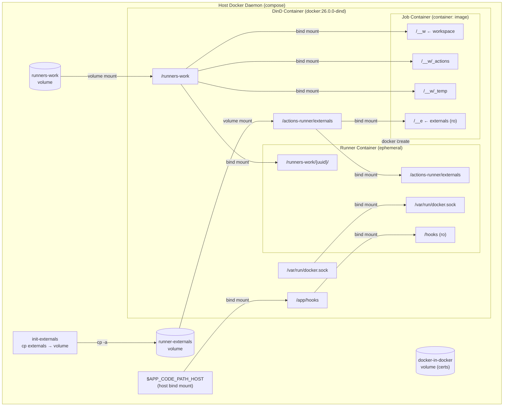
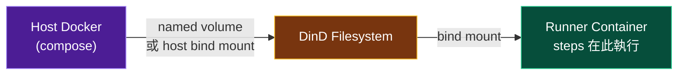
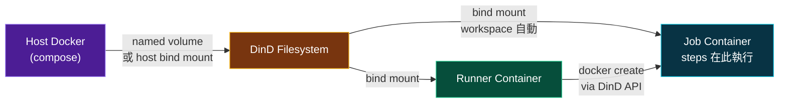
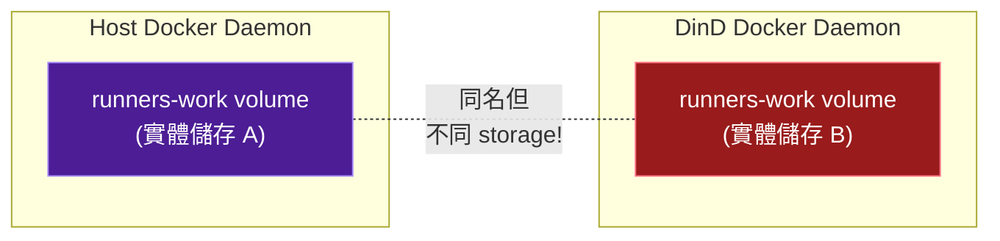
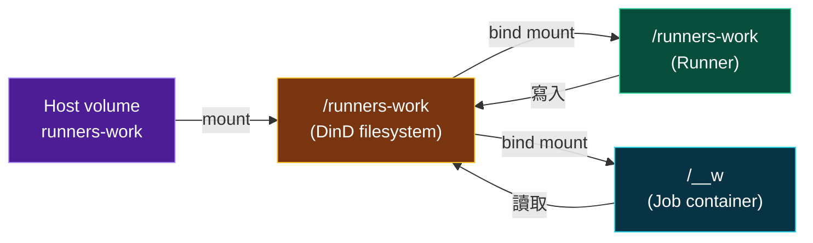
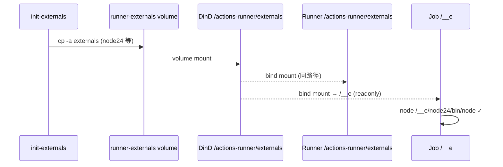
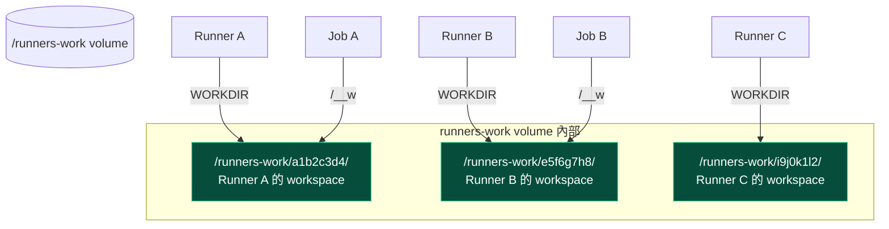
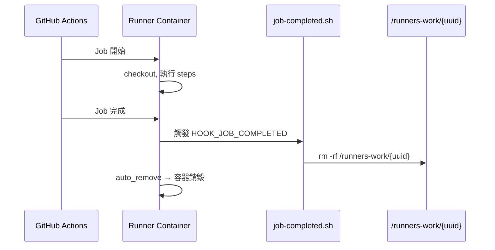

# DinD Container Job 架構說明

## 概述

本專案使用 Docker-in-Docker（DinD）架構管理 GitHub Actions self-hosted runner。當 workflow 使用 `container:` 語法指定預編譯映像執行測試時，runner 需要在 DinD 中啟動 job container 並共享 workspace。

本文件說明 DinD 中 runner container 與 job container 之間的 volume 共享機制，以及實作過程中遇到的關鍵問題。

---

## 架構總覽



---

## Volume 映射

Volume 傳遞路徑依 workflow 是否使用 `container:` 語法而不同。

### 情境 A：workflow 不使用 `container:`

Steps 直接在 Runner container 內執行，Job container 不存在，volume 僅需兩層傳遞。



此情境中：

- 所有 runner 預設掛載皆可直接使用（`/runners-work/{uuid}`、`/actions-runner/externals`、`/hooks`）
- workflow yaml 無需任何 volume 宣告
- `RUNNER_WORKDIR=/runners-work/{uuid}` 即為 steps 的工作目錄

### 情境 B：workflow 使用 `container:`

Runner 透過 DinD daemon 建立 Job container，steps 改在 Job container 內執行，volume 需三層傳遞。



此情境中：

- Runner container 仍存在（負責呼叫 DinD daemon 建立 Job container、執行 job-completed hook）
- `/__w`、`/__w/_actions`、`/__w/_temp`、`/__e` 由 GitHub Actions runner binary 自動掛載

### 各層掛載明細

| 層級 | 來源 | 目標路徑 | 掛載類型 |
|------|------|----------|----------|
| Host → DinD | `runners-work` volume | `/runners-work` | named volume |
| Host → DinD | `runner-externals` volume | `/actions-runner/externals` | named volume |
| Host → DinD | `docker-in-docker` volume | `/certs/client` | named volume |
| Host → DinD | `${APP_CODE_PATH_HOST}` | `${APP_CODE_PATH_CONTAINER}`（含 `/app/hooks`）| host bind mount |
| DinD → Runner | `/runners-work` | `/runners-work` | bind mount |
| DinD → Runner | `/actions-runner/externals` | `/actions-runner/externals` | bind mount |
| DinD → Runner | `/var/run/docker.sock` | `/var/run/docker.sock` | bind mount |
| DinD → Runner | `/app/hooks` | `/hooks` (ro) | bind mount |
| DinD → Job | `/runners-work/{uuid}` | `/__w` | bind mount（runner binary 自動）|
| DinD → Job | `/runners-work/{uuid}/_actions` | `/__w/_actions` | bind mount（runner binary 自動）|
| DinD → Job | `/runners-work/{uuid}/_temp` | `/__w/_temp` | bind mount（runner binary 自動）|
| DinD → Job | `/actions-runner/externals` | `/__e` (ro) | bind mount（runner binary 自動）|

---

## 關鍵問題：Named Volume vs Bind Mount

### 問題

DinD 架構中存在 **兩個獨立的 Docker daemon**，各自管理自己的 volume namespace：



如果在 `DynamicRunner.create()` 中使用 named volume 語法：

```python
# ✗ 錯誤 — 這會建立 DinD daemon 自己的 named volume，與 Host 的不同
volumes=["runners-work:/runners-work"]
```

Runner 寫入的是 DinD daemon 的 volume，但 job container 的 bind mount 解析的是 DinD **container filesystem** 上的路徑（Host 的 volume），兩邊看到的是不同的 storage。

### 解法

使用 **bind mount**（以 `/` 開頭），直接掛載 DinD container 的 filesystem：

```python
# ✓ 正確 — bind mount DinD 的 filesystem（即 Host volume 的掛載點）
volumes=["/runners-work:/runners-work"]
```



---

## Externals 共享機制

GitHub Actions runner 執行 JavaScript-based actions（如 `actions/checkout`）時需要 Node.js，存放在 `/actions-runner/externals/`。Job container 透過 `/__e` 路徑存取。

### 問題

DinD container 的 `runner-externals` volume 掛載到 `/actions-runner/externals`，但 DinD 映像本身不包含 externals 內容，所以該路徑為空。

### 解法

使用 `init-externals` service 從 runner 映像預先複製 externals 到 volume：

```yaml
# compose.yml
init-externals:
  image: myoung34/github-runner:ubuntu-noble
  restart: "no"
  entrypoint: ["sh", "-c", "cp -a /actions-runner/externals/. /ext-out/"]
  volumes:
    - runner-externals:/ext-out
```



---

## 並行 Runner 隔離

多個 runner 同時執行時，每個 runner 使用唯一的 workspace 子目錄：



實作方式（`DynamicRunner.create()`）：

```python
runner_id = uuid.uuid4().hex[:8]
workdir = f"/runners-work/{runner_id}"  # 唯一子目錄

environment = {
    "RUNNER_WORKDIR": workdir,
    # ...
}
```

---

## Job 完成後的清理

使用 `ACTIONS_RUNNER_HOOK_JOB_COMPLETED` 環境變數，runner 在 job 結束後自動執行清理腳本：



清理腳本（`hooks/job-completed.sh`）：

```bash
#!/bin/sh
if [ -n "$RUNNER_WORKDIR" ] && [ -d "$RUNNER_WORKDIR" ]; then
    rm -rf "$RUNNER_WORKDIR"
fi
```

---

## 設定說明

### Runner 固定行為

所有 runner 一律採用下列配置，無需環境變數切換：

- Volume 策略：`/runners-work`（workspace）+ `/actions-runner/externals`（runner 工具）+ `/app/hooks:ro`（清理 hook）
- Workspace：`/runners-work/{uuid}` 唯一子目錄，每個 runner 獨立
- 清理：啟用 `ACTIONS_RUNNER_HOOK_JOB_COMPLETED`，job 結束時自動刪除對應的 workspace 子目錄

### 為 job container 宣告額外掛載

使用 `container:` 語法的 workflow 若需要存取 DinD filesystem 上的額外路徑，必須由 workflow 作者在 yaml 中自行宣告 volume，例如：

```yaml
jobs:
  test:
    runs-on: [self-hosted]
    container:
      image: php:8.2
      volumes:
        - /app/your-fixtures:/fixtures
    steps:
      - uses: actions/checkout@v4
      - run: ./run-tests.sh
```

DinD container 本身已掛載 `${APP_CODE_PATH_HOST}:${APP_CODE_PATH_CONTAINER}`（見 `compose.yml`），因此該路徑在 DinD 的 filesystem 中存在，job container 可直接 bind mount。系統不會自動為 job container 注入此掛載。

### Docker Compose 新增服務

```yaml
volumes:
  runners-work:     # Runner workspace 共享
  runner-externals: # Node.js 等 runner 工具

services:
  init-externals:   # 一次性複製 externals 到 volume
  docker-in-docker:
    volumes:
      - runners-work:/runners-work
      - runner-externals:/actions-runner/externals
```

### 部署注意事項

1. 首次啟用或更新 runner 映像後，需重建 volume：
   ```bash
   docker compose down -v
   docker compose up -d
   ```

2. `init-externals` service 會自動執行一次並退出（`restart: "no"`）

3. 使用 `container:` 語法且需要額外路徑的 workflow 必須自行在 yaml 的 `container.volumes` 宣告；系統不會自動注入此類掛載
